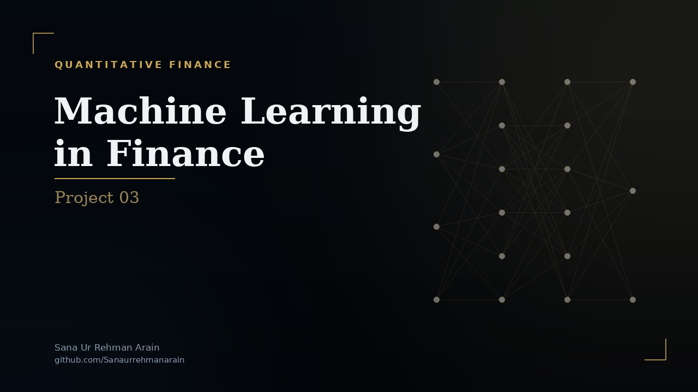

<div align="center">
  <a href="Project Report.pdf">
    
  </a>
  <p><em>Click the banner to view the full analysis report</em></p>
</div>

# Machine Learning in Finance 
## Advanced Model Optimization & Ensemble Learning

**Team Alpha:**
* Sana Ur Rehman Arain
* Abrar Ahmed
* Qhayiya Mayinje

### Project Overview
This project addresses three critical questions posed by portfolio strategists regarding the reliability and deployment of our Machine Learning models:
1.  **Hyperparameter Optimization:** How do we ensure model settings are optimal?
2.  **Bias-Variance Tradeoff:** How do we ensure the model generalizes to future data?
3.  **Ensemble Learning:** Can combining models improve performance?

Using real-world financial data (S&P 500 and Sector ETFs via Yahoo Finance), we rigorously tested LASSO Regression, Random Forests, and Stacking Ensembles.

### Key Findings
* **Optimization:** Identified optimal regularization ($\alpha = 0.000132$) using 5-fold Cross-Validation.
* **Generalization:** Achieved convergence of Bias and Variance, resulting in a robust $R^2$ of 0.97.
* **Ensemble Analysis:** Demonstrated that while Random Forests perform well ($R^2=0.95$), highly linear market regimes favor parsimonious linear models (LASSO $R^2=0.97$) over complex Stacking ensembles ($R^2=0.84$).

### Repository Structure
* `Report.pdf` - The final Technical and Non-Technical report.
* `Project_Notebook.ipynb` - Executable Jupyter Notebook with all code and visualizations.
* `requirements.txt` - List of dependencies.

### Usage
Run the Jupyter notebook to replicate the analysis:
```bash
pip install -r requirements.txt
jupyter notebook
```
---

## Citation

If you use this project in academic research, publications, educational
materials, or derivative works, please cite the project.

This repository includes a `CITATION.cff` file, so GitHub provides a
**"Cite this repository"** button in the repository sidebar. You can use it
to obtain citations in BibTeX, APA, and other supported formats.

**Suggested citation:**

Arain, S. U. R. (2026). ml-finance-ensemble-optimization (Version 1.0) [Software].
<https://github.com/sanaurrehmanarain/ml-finance-ensemble-optimization>

**Author:** Sana Ur Rehman Arain

**Profession:** Data Scientist

**GitHub:** <https://github.com/sanaurrehmanarain>

**Contact:** <sana.arain.work@gmail.com>

If you build upon this work, attribution is appreciated and helps others
discover the original project.

> **Note:** The MIT License requires that the original copyright
> notice be retained in copies of the Software.

---

## License

This project is licensed under the MIT License. See the
[LICENSE](LICENSE) file for details.
